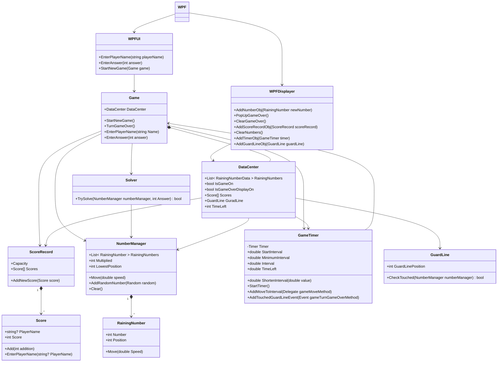

```mermaid
classDiagram

class Score{
    +string? PlayerName
    +int Score
    +Add(int addition)
    +EnterPlayerName(string? PlayerName)
}

class ScoreRecord{
    +Capacity
    +Score[] Scores
    +AddNewScore(Score score)
}

class NumberManager{
    +List< RainingNumber > RainingNumbers
    +int Multiplied
    +int LowestPosition
    +Move(double speed)
    +AddRandomNumber(Random random)
    +Clear()
}

class RainingNumber{
    +int Number
    +int Position
    +Move(double Speed)
}

class Game{
    +StartNewGame()
    +TurnGameOver()
    +EnterPlayerName(string Name)
    +EnterAnswer(int answer)
    +DataCenter DataCenter
}

class DataCenter{
    +List< RainingNumberData > RainingNumbers
    +bool IsGameOn
    +bool IsGameOverDisplayOn
    +Score[] Scores
    +GuardLine GuradLine
    +int TimeLeft
}


class GameTimer{
    -Timer Timer
    +double StartInterval
    +double MinimumInterval
    +double Interval
    +double TimeLeft
    +double ShortenInterval(double value)
    +StartTimer()
    +AddMoveToInterval(Delegate gameMoveMethod)
    +AddTouchedGuardLineEvent(Event gameTurnGameOverMethod)
}

class GuardLine{
    +int GuardLinePosition
    +CheckTouched(NumberManager numberManager) bool
}

class Solver{
    +TrySolve(NumberManager numberManager, int Answer) bool
}

class WPFUI{
    +EnterPlayerName(string playerName)
    +EnterAnswer(int answer)
    +StartNewGame(Game game)

}

class WPFDisplayer{
    +AddNumberObj(RainingNumber newNumber)
    +PopUpGameOver()
    +ClearGameOver()
    +AddScoreRecordObj(ScoreRecord scoreRecord)
    +ClearNumbers()
    +AddTimerObj(GameTimer timer)
    +AddGuardLineObj(GuardLine guardLine)
}

WPF --> WPFUI
WPF --> WPFDisplayer
WPFUI --> Game
WPFDisplayer --> DataCenter
Game *-- DataCenter
Game --> NumberManager
Game --> GameTimer
GameTimer --> Game
Game --> ScoreRecord
Game --> Solver
Solver --> NumberManager
NumberManager "1" *--> "*" RainingNumber
ScoreRecord "1" *--> "*" Score
DataCenter --> GuardLine
DataCenter --> ScoreRecord
DataCenter --> GameTimer
DataCenter --> NumberManager

```