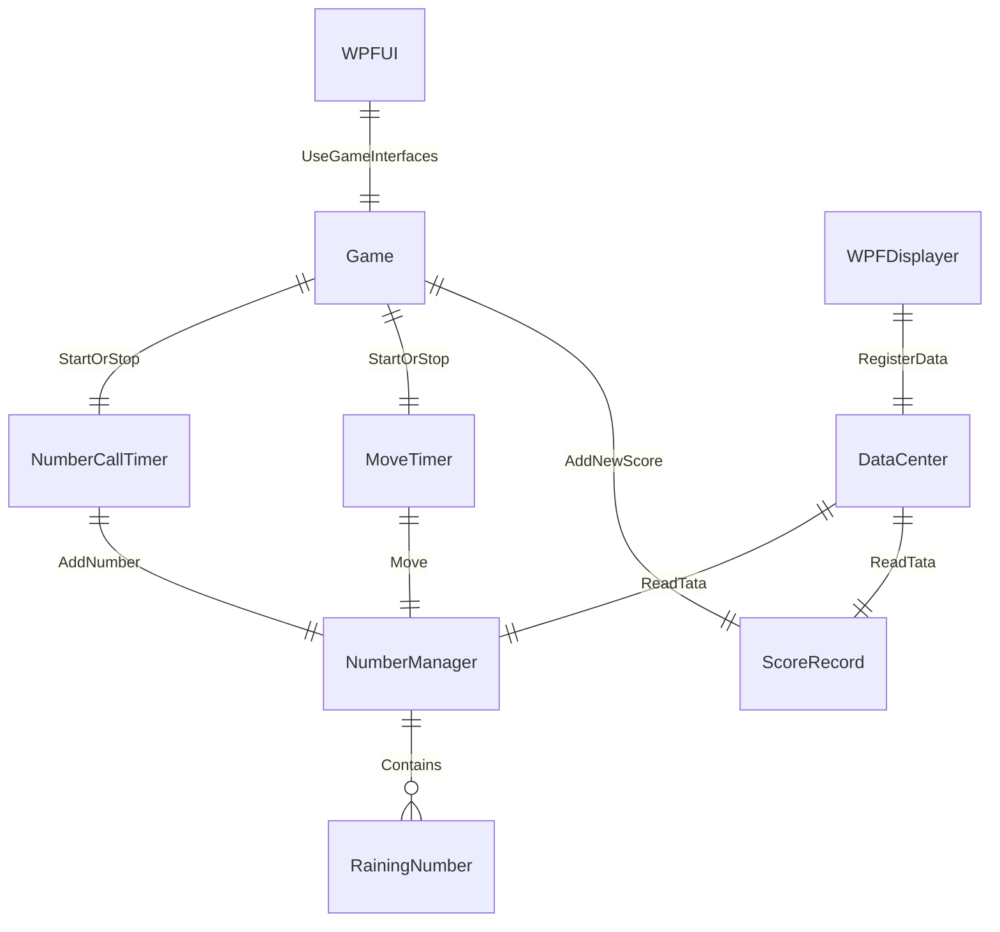

```mermaid
erDiagram
    WPFUI ||--|| Game : UseGameInterfaces
    WPFDisplayer ||--|| DataCenter : RegisterData
    Game ||--|| ScoreRecord : AddNewScore
    Game ||--|| MoveTimer : StartOrStop
    Game ||--|| NumberCallTimer : StartOrStop
    MoveTimer ||--|| NumberManager : Move
    NumberCallTimer ||--|| NumberManager : AddNumber
    DataCenter ||--|| ScoreRecord : ReadTata
    DataCenter ||--|| NumberManager : ReadTata
    NumberManager ||--o{ RainingNumber : Contains

```